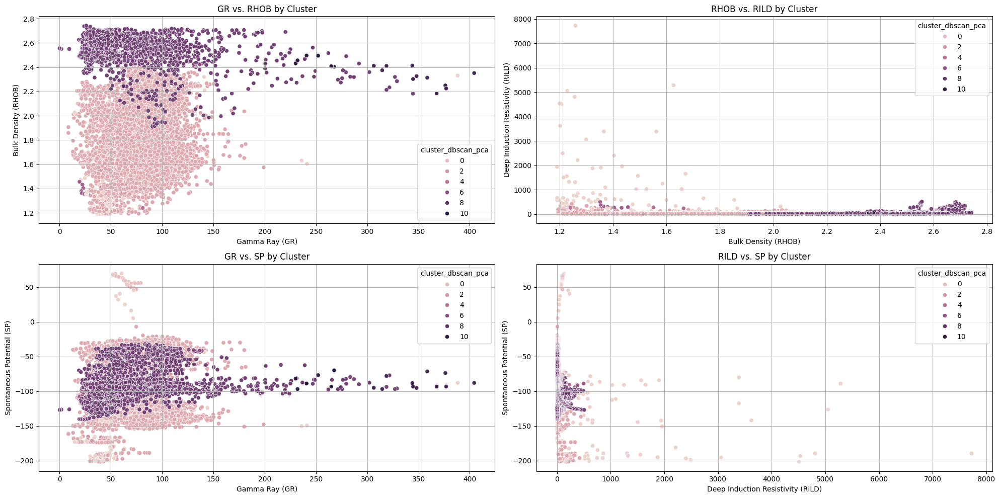

# lithofacies-clustering
Analysis of well log data using PCA, KMeans and DBSCAN clustering to identify lithofacies trends.

# Well Log Lithofacies Analysis Using PCA and DBSCAN Clustering

This project utilizes Principal Component Analysis (PCA) and DBSCAN clustering to analyze well log data and identify distinct lithofacies trends.

## Dataset

The dataset was obtained from Kaggle and contains the following columns:

* **Depth (ft):** Measured depth of the well (in feet).
* **GR (API):** Gamma Ray (American Petroleum Institute units).
* **ILD_log10 (log10(ohm-m)):** Base-10 logarithm of deep induction resistivity.
* **DeltaPHI (v/v):** Difference between neutron porosity and density porosity.
* **PHIND (v/v):** Neutron porosity.
* **PE (b/e):** Photoelectric effect.
* **NM_M (v/v):** Normalized M parameter.
* **RELPOS:** Relative position.
* **RHOB (g/cm³):** Bulk density.
* **PHID (v/v):** Density porosity.
* **NM_P (v/v):** Normalized P parameter.
* **RILD (ohm-m):** Deep induction resistivity.
* **SP (mV):** Spontaneous potential.

**Note:** For this analysis, we primarily focused on the well log features (GR, RHOB, RILD, SP) for lithofacies interpretation.

## Methodology

## Methodology

1.  **Data Preprocessing:**
    * [Describe any data cleaning or preprocessing steps]

2.  **K-means Clustering (Initial Exploration):**
    * As an initial step, K-means clustering was performed to explore potential groupings within the data.
    * **Elbow Method:** The elbow method was used to determine the optimal number of clusters (k). The plot of within-cluster sum of squares (WCSS) against the number of clusters showed an "elbow" at k = [Optimal k value], suggesting this as a suitable number of clusters.
    * **Silhouette Method:** The silhouette score was calculated for different values of k to validate the optimal k value. The highest silhouette score was observed at k = [Optimal k value], further supporting the choice of this number of clusters.
    * [Optional: Include images of the elbow and silhouette plots if you have them.]

3.  **Principal Component Analysis (PCA):**
    * PCA was applied to reduce the dimensionality of the well log data and identify the principal components that explain the most variance.
    * The first two principal components (PC1 and PC2) were used for visualization and clustering.

4.  **DBSCAN Clustering (Final Clustering):**
    * DBSCAN (Density-Based Spatial Clustering of Applications with Noise) was used to identify clusters of similar well log measurements in the PCA space.
    * The `epsilon` and `min_samples` parameters were tuned to achieve meaningful clusters.
    * Noise points (outliers) were identified and labeled as -1.

5.  **Crossplot Analysis:**
    * Crossplots were generated to visualize the relationships between different well log measurements and how they relate to the identified DBSCAN clusters.
    * The following crossplots were created:
        * GR vs. RHOB
        * RHOB vs. RILD
        * GR vs. SP
        * RILD vs. SP
    * **Note:** The crossplot images are generated within the code and displayed using `matplotlib.pyplot.show()`.

## Results and Interpretation

### Crossplot Visualizations

  
### Average Well Log Values

| Cluster | GR (avg.) | RHOB (avg.) | RILD (avg.) | SP (avg.) | Possible Lithology | Notes |
|---|---|---|---|---|---|---|
| -1 (Noise) | 62.95 | 1.52 | 870.35 | -122.36 | Mixed, outliers, tight formations | High RILD is notable |
| 0 | 66.29 | 1.69 | 90.39 | 57.96 | Permeable shaly sandstone/shale | Positive SP, but low RILD |
| 1 | 80.99 | 1.83 | 12.21 | -95.20 | Shale | Classic shale signature |
| 2 | 34.81 | 1.63 | 12.05 | -168.74 | Possible pyrite zone/odd shale | Inconsistent logs, needs investigation |
| 3 | 39.48 | 1.26 | 193.31 | -194.93 | Porous sandstone? Tight zone? | Conflicting logs, needs investigation |
| 4 | 74.00 | 1.49 | 254.47 | -96.71 | Shaly tight zone/hydrocarbons? | High RILD, needs investigation |
| 5 | 23.20 | 1.39 | 327.06 | -98.18 | Sandstone/carbonate, tight | High RILD, needs investigation |
| 6 | 129.16 | 2.43 | 3.94 | -41.33 | Very dense shale/metallic shale | Extreme values, needs investigation |
| 7 | 66.05 | 2.57 | 41.08 | -92.09 | Carbonate/dense shale | High RHOB |
| 8 | 79.28 | 2.25 | 10.00 | -78.91 | Dense shale | High RHOB |
| 9 | 350.92 | 2.32 | 21.12 | -87.76 | Very dense radioactive shale | Extreme GR |
| 10 | 247.96 | 2.45 | 20.26 | -84.52 | Very dense radioactive shale | Extreme GR |

### Lithofacies Interpretations

* **Shale:** Clusters with high GR, low RHOB, and low SP likely represent shale lithofacies (e.g., Cluster 1, 8, 9, 10).
* **Carbonate:** Clusters with low GR and high RHOB likely represent carbonate lithofacies (e.g., Cluster 7).
* **Sandstone:** Clusters with low GR and low RHOB likely represent sandstone lithofacies (e.g., Cluster 5).
* **Tight Formations/Hydrocarbons:** Clusters with high RILD likely represent tight formations or hydrocarbon-bearing zones (e.g., Cluster 5, 4).
* **Transitional Lithofacies:** Overlapping clusters likely represent transitional lithofacies or interbedded layers (e.g., Cluster 0).
* **Cluster 6:** This cluster exhibits extreme values, suggesting a very dense, potentially radioactive shale, possibly a metallic shale.
* **Clusters 2, 3, and 4:** These clusters display inconsistencies that require further investigation.

## Limitations

* This analysis is based on four well logs and lacks geological context and core data.
* The DBSCAN clustering algorithm is sensitive to parameter selection.
* The interpretation of Clusters 2, 3, and 4 remains uncertain.

## Future Work

* Obtain geological information about the formation.
* Integrate core data (descriptions, photos, analysis).
* Incorporate additional well logs (neutron porosity, sonic logs).
* Perform petrophysical analysis (mineralogical analysis, fluid saturation modeling).
* Explore other clustering algorithms.

## How to Run

1.  Clone the repository: `git clone [repository URL]`
2.  Install dependencies: `pip install -r requirements.txt`
3.  Run the code: `python your_script.py` (or `jupyter notebook your_notebook.ipynb`)

## Dependencies
